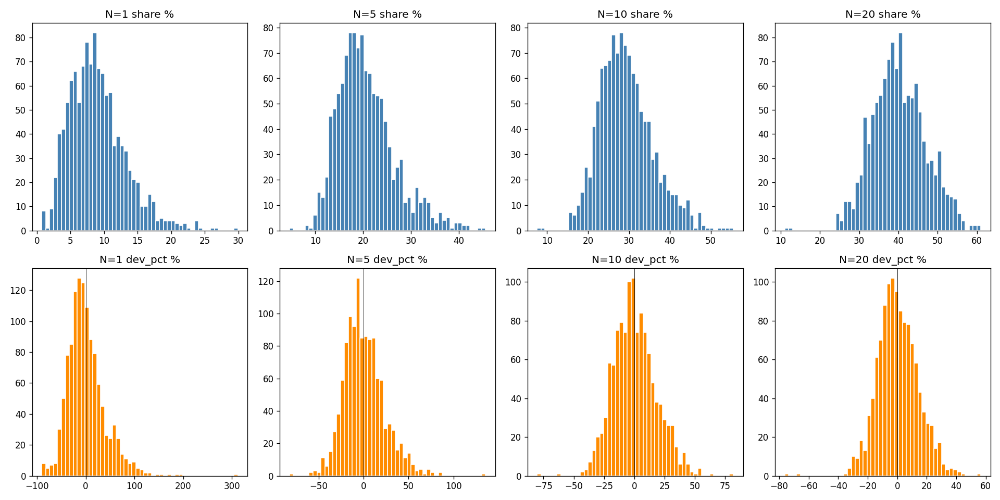
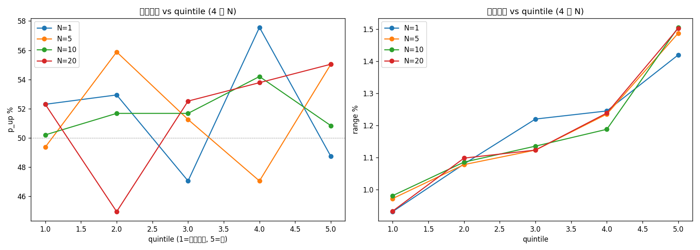

# H080 前 20 權值股集中度 — Phase 0+1 Implementation Plan

> **For agentic workers:** REQUIRED SUB-SKILL: Use superpowers:subagent-driven-development (recommended) or superpowers:executing-plans to implement this plan task-by-task. Steps use checkbox (`- [ ]`) syntax for tracking.

**Goal:** 建立 `top_lists` + `concentration_index` 資料管線（多 N 寬表），執行 Phase 1 分佈探索（1A–1H），輸出 `distribution.md` 與 GATE 評估。

**Architecture:** 兩階段。Phase 0：純 DuckDB SQL 從既有 `stock_day` 算月度 top 20 排名 + 每日 4 個 N（1/5/10/20）的集中度寬表。Phase 1：單一 `explore.py` 腳本，分段函數對應 1A–1G 各分析；結果寫 `results/*.csv`，最終彙整成 `distribution.md` + GATE。

**Tech Stack:** Python 3.14+, DuckDB 1.x, pandas, matplotlib, scipy.stats（chi-square / Mann-Whitney），uv 執行。

**範圍**：本 plan 只涵蓋 Phase 0 + Phase 1。Phase 2（回測）需 GATE 通過後另起 plan。Phase 1.5（即時集中度驗證）為後續延伸，不在本 plan。

**清單來源妥協**：用「上月成交金額前 20」近似 TAIEX 市值權重前 20（理由與升級路徑詳見 proposal.md「清單來源決策」一節）。

---

## File Structure

```
src/etl/
├── build_top_lists.py              # NEW: stock_day → top_lists（月度 top 20 排名）
└── build_concentration_index.py    # NEW: stock_day + market_breadth + top_lists → concentration_index（寬表 4 個 N）

research/active/H080-top20-concentration-regime/
├── proposal.md                     # 已存在（spec）
├── tasks.md                        # 已存在（任務清單）
├── plan.md                         # 本檔
├── explore.py                      # NEW: Phase 1 主分析腳本
├── distribution.md                 # NEW: Phase 1 結論 + GATE 評估（最後寫）
└── results/
    ├── timeseries.csv              # 每日 4 個 N 的 share / dev_pct + TX OHLC
    ├── distribution_overview.png   # 1A 視覺化
    ├── A_quintile_by_N.csv         # 1B：5 桶 × 4 個 N 的漲日機率、振幅
    ├── A_quintile_by_N.png         # 1B 視覺化
    ├── B_3x9_grid_top20.csv        # 1C：27 格條件機率（主分析）
    ├── B_3x9_grid_top5.csv         # 1C 補充（若 1B 顯示 N=5 訊號更強）
    ├── C_crash_by_bucket.csv       # 1D
    ├── D_list_changes.csv          # 1E
    ├── E_correlation_with_h079.csv # 1F
    └── F_weekday_breakdown.csv     # 1G（條件性）
```

不修改既有檔案。

---

## Phase 0: 資料管線（3 tasks）

### Task 0.1: 建立 `top_lists` 表 + ETL

**目標**：從 `stock_day` 計算每月個股成交金額加總，排序取 top 20，寫入 `top_lists`。

**Files:**
- Create: `src/etl/build_top_lists.py`
- DB: 新增 `top_lists` 表

- [ ] **Step 1: 寫 `build_top_lists.py` 骨架**

```python
"""H080 ETL: 從 stock_day 計算月度成交金額前 20 排名 → top_lists 表。

清單用途：作為 build_concentration_index.py 中「上月套用本月」的清單來源。
注意：TAIEX 只含上市，故 WHERE market='TWSE'，排除 TPEX。

用法:
  uv run python src/etl/build_top_lists.py                # 全期重建（預設）
  uv run python src/etl/build_top_lists.py --start 2024-01 --end 2026-05
"""
from __future__ import annotations

import argparse
from pathlib import Path

import duckdb

PROJECT_ROOT = Path(__file__).parent.parent.parent
DB_PATH = PROJECT_ROOT / "data" / "futures.duckdb"


DDL = """
CREATE TABLE IF NOT EXISTS top_lists (
    list_month     VARCHAR,
    rank           INT,
    symbol         VARCHAR,
    name           VARCHAR,
    monthly_value  BIGINT,
    PRIMARY KEY (list_month, rank)
);
"""

BUILD_SQL = """
INSERT OR REPLACE INTO top_lists
WITH monthly AS (
    SELECT
        strftime(trade_date, '%Y-%m')   AS list_month,
        symbol,
        ANY_VALUE(name)                  AS name,
        SUM(value)                       AS monthly_value
    FROM stock_day
    WHERE market = 'TWSE'
      AND strftime(trade_date, '%Y-%m') BETWEEN ? AND ?
    GROUP BY list_month, symbol
),
ranked AS (
    SELECT
        list_month, symbol, name, monthly_value,
        ROW_NUMBER() OVER (PARTITION BY list_month ORDER BY monthly_value DESC) AS rank
    FROM monthly
)
SELECT list_month, rank, symbol, name, monthly_value
FROM ranked
WHERE rank <= 20
ORDER BY list_month, rank;
"""


def build(start_month: str, end_month: str) -> None:
    with duckdb.connect(str(DB_PATH)) as conn:
        conn.execute(DDL)
        conn.execute(BUILD_SQL, [start_month, end_month])
        n = conn.execute(
            "SELECT COUNT(*) FROM top_lists WHERE list_month BETWEEN ? AND ?",
            [start_month, end_month],
        ).fetchone()[0]
        print(f"top_lists: 寫入 {n} 筆 ({start_month} ~ {end_month})")


def main() -> None:
    parser = argparse.ArgumentParser()
    parser.add_argument("--start", default="2018-01", help="YYYY-MM")
    parser.add_argument("--end", default="2026-12", help="YYYY-MM")
    args = parser.parse_args()
    build(args.start, args.end)


if __name__ == "__main__":
    main()
```

- [ ] **Step 2: 跑全期建表**

Run: `uv run python src/etl/build_top_lists.py`
Expected: `top_lists: 寫入 約 2000 筆 (2018-01 ~ 2026-12)`（每月 20 筆 × ~100 個月）

- [ ] **Step 3: 驗證 — 抽 3 個月對照**

Run:
```bash
uv run python -c "
import duckdb
with duckdb.connect('data/futures.duckdb', read_only=True) as conn:
    for m in ['2018-06', '2021-08', '2024-12']:
        print(f'\n=== {m} top 5 ===')
        for r in conn.execute('SELECT rank, symbol, name, monthly_value FROM top_lists WHERE list_month=? AND rank<=5 ORDER BY rank', [m]).fetchall():
            print(f'  {r[0]:>2}  {r[1]:<6} {r[2]:<10} value={r[3]:,}')
"
```
Expected: 三個月份的 rank 1 都是 `2330 台積電`（如有例外，記錄於 distribution.md「資料異常」一節）

- [ ] **Step 4: 提交**

```bash
git add src/etl/build_top_lists.py
git commit -m "feat: H080 top_lists ETL — monthly top-20 by stock_day value"
```

---

### Task 0.2: 建立 `concentration_index` 表 + ETL（4 個 N 寬表）

**目標**：對每個交易日，套用 `t-1 月` 的 top_lists 排名，計算 N=1/5/10/20 的成交金額佔比、ma20、std20、deviation_pct、zscore，存入 `concentration_index`。

**Files:**
- Create: `src/etl/build_concentration_index.py`
- DB: 新增 `concentration_index` 表

- [ ] **Step 1: 寫 ETL 骨架**

```python
"""H080 ETL: stock_day + market_breadth + top_lists → concentration_index 寬表。

對每個交易日 t，套用 list_month = strftime(t - INTERVAL 1 MONTH, '%Y-%m')
的 top 20 排名，分別計算 N=1/5/10/20 的成交金額佔比與 20 日平滑指標。

用法:
  uv run python src/etl/build_concentration_index.py
  uv run python src/etl/build_concentration_index.py --start 2018-01-02 --end 2026-12-31
"""
from __future__ import annotations

import argparse
from datetime import date
from pathlib import Path

import duckdb

PROJECT_ROOT = Path(__file__).parent.parent.parent
DB_PATH = PROJECT_ROOT / "data" / "futures.duckdb"

N_VALUES = [1, 5, 10, 20]


def _ddl_columns() -> str:
    cols = []
    for n in N_VALUES:
        cols.append(f"top{n}_value BIGINT, top{n}_share DECIMAL(8,4)")
    for n in N_VALUES:
        cols.append(
            f"top{n}_ma20 DECIMAL(8,4), top{n}_std20 DECIMAL(8,4), "
            f"top{n}_dev_pct DECIMAL(8,4), top{n}_zscore DECIMAL(8,4)"
        )
    return ",\n    ".join(cols)


DDL = f"""
DROP TABLE IF EXISTS concentration_index;
CREATE TABLE concentration_index (
    trade_date    DATE PRIMARY KEY,
    list_month    VARCHAR,
    total_value   BIGINT,
    {_ddl_columns()},
    list_changed  BOOLEAN
);
"""


# 第一階段：算每天每個 N 的 top_value（不含 ma20/std20，後續用 window function 填）
STAGE1_SQL = """
INSERT INTO concentration_index (
    trade_date, list_month, total_value,
    top1_value, top1_share, top5_value, top5_share,
    top10_value, top10_share, top20_value, top20_share, list_changed
)
WITH days AS (
    SELECT DISTINCT trade_date,
           strftime(trade_date - INTERVAL 1 MONTH, '%Y-%m') AS list_month
    FROM stock_day
    WHERE trade_date BETWEEN ? AND ?
),
day_value AS (
    SELECT d.trade_date, d.list_month,
           tl.symbol, tl.rank, sd.value
    FROM days d
    JOIN top_lists tl ON tl.list_month = d.list_month
    LEFT JOIN stock_day sd ON sd.trade_date = d.trade_date AND sd.symbol = tl.symbol
),
agg AS (
    SELECT trade_date, list_month,
           SUM(CASE WHEN rank <= 1  THEN COALESCE(value,0) END) AS top1_value,
           SUM(CASE WHEN rank <= 5  THEN COALESCE(value,0) END) AS top5_value,
           SUM(CASE WHEN rank <= 10 THEN COALESCE(value,0) END) AS top10_value,
           SUM(CASE WHEN rank <= 20 THEN COALESCE(value,0) END) AS top20_value
    FROM day_value
    GROUP BY trade_date, list_month
),
mb AS (
    SELECT trade_date, SUM(total_value) AS total_value
    FROM market_breadth
    WHERE market = 'TWSE'              -- TAIEX 只含上市
      AND trade_date BETWEEN ? AND ?
    GROUP BY trade_date
)
SELECT a.trade_date, a.list_month, mb.total_value,
       a.top1_value,  CAST(a.top1_value  * 100.0 / NULLIF(mb.total_value,0) AS DECIMAL(8,4)),
       a.top5_value,  CAST(a.top5_value  * 100.0 / NULLIF(mb.total_value,0) AS DECIMAL(8,4)),
       a.top10_value, CAST(a.top10_value * 100.0 / NULLIF(mb.total_value,0) AS DECIMAL(8,4)),
       a.top20_value, CAST(a.top20_value * 100.0 / NULLIF(mb.total_value,0) AS DECIMAL(8,4)),
       FALSE        -- list_changed 先填 FALSE，後續用 _compute_list_changed 更新
FROM agg a
JOIN mb ON mb.trade_date = a.trade_date
ORDER BY a.trade_date;
"""


def _compute_list_changed(conn: duckdb.DuckDBPyConnection) -> None:
    """用 pandas 算每月清單與上月差異（top 20 symbol set），update 回 concentration_index。"""
    df = conn.execute(
        "SELECT list_month, symbol FROM top_lists WHERE rank <= 20 ORDER BY list_month"
    ).fetchdf()
    months = sorted(df["list_month"].unique())
    prev_set: set[str] = set()
    changed: dict[str, bool] = {}
    for m in months:
        cur = set(df.loc[df["list_month"] == m, "symbol"])
        changed[m] = bool(prev_set) and bool(cur - prev_set)
        prev_set = cur
    for m, c in changed.items():
        conn.execute(
            "UPDATE concentration_index SET list_changed = ? WHERE list_month = ?", [c, m]
        )


# 第二階段：window function 填 ma20/std20/deviation_pct/zscore
def _stage2_sql() -> str:
    parts = []
    for n in N_VALUES:
        parts.append(f"""
UPDATE concentration_index AS ci SET
    top{n}_ma20    = m.ma20,
    top{n}_std20   = m.std20,
    top{n}_dev_pct = CASE WHEN m.ma20 = 0 THEN NULL
                          ELSE (ci.top{n}_share - m.ma20) * 100.0 / m.ma20 END,
    top{n}_zscore  = CASE WHEN m.std20 = 0 OR m.std20 IS NULL THEN NULL
                          ELSE (ci.top{n}_share - m.ma20) / m.std20 END
FROM (
    SELECT trade_date,
           AVG(top{n}_share) OVER w AS ma20,
           STDDEV(top{n}_share) OVER w AS std20
    FROM concentration_index
    WINDOW w AS (ORDER BY trade_date ROWS BETWEEN 19 PRECEDING AND CURRENT ROW)
) m
WHERE m.trade_date = ci.trade_date;
""")
    return "\n".join(parts)


def build(start: date, end: date) -> None:
    with duckdb.connect(str(DB_PATH)) as conn:
        conn.execute(DDL)
        conn.execute(STAGE1_SQL, [start, end, start, end])
        conn.execute(_stage2_sql())
        _compute_list_changed(conn)
        n = conn.execute("SELECT COUNT(*) FROM concentration_index").fetchone()[0]
        print(f"concentration_index: 寫入 {n} 列")


def main() -> None:
    parser = argparse.ArgumentParser()
    parser.add_argument("--start", default="2018-01-01", type=date.fromisoformat)
    parser.add_argument("--end", default="2026-12-31", type=date.fromisoformat)
    args = parser.parse_args()
    build(args.start, args.end)


if __name__ == "__main__":
    main()
```

- [ ] **Step 2: 跑全期建表**

Run: `uv run python src/etl/build_concentration_index.py`
Expected: `concentration_index: 寫入 約 2000 列`

- [ ] **Step 3: 驗證 — 抽近期日對照**

Run:
```bash
uv run python -c "
import duckdb
with duckdb.connect('data/futures.duckdb', read_only=True) as conn:
    print(conn.execute('''
        SELECT trade_date, list_month,
               total_value/1e9 AS total_b,
               top1_share, top5_share, top10_share, top20_share,
               top20_dev_pct, list_changed
        FROM concentration_index
        WHERE trade_date >= '2026-04-01'
        ORDER BY trade_date DESC LIMIT 10
    ''').fetchdf())
"
```
Expected:
- `top1_share` 約 15–25%（台積電獨佔）
- `top5_share` 約 30–40%
- `top20_share` 約 50–65%
- `top20_dev_pct` 多在 ±15% 區間
- `total_b`（單位：十億）每日 200–400

- [ ] **Step 4: 驗證 — 確認 ma20 暖機後 dev_pct 非 NULL 比例**

Run:
```bash
uv run python -c "
import duckdb
with duckdb.connect('data/futures.duckdb', read_only=True) as conn:
    r = conn.execute('SELECT COUNT(*), COUNT(top20_dev_pct) FROM concentration_index').fetchone()
    print(f'總列={r[0]}, dev_pct 有值={r[1]} (應接近總列 - 19)')
"
```
Expected: 有值列數 = 總列 - 19（ma20 前 19 列為 NULL）

- [ ] **Step 5: 提交**

```bash
git add src/etl/build_concentration_index.py
git commit -m "feat: H080 concentration_index ETL — multi-N (1/5/10/20) wide table"
```

---

### Task 0.3: ETL 整合驗證（手動抽樣對照）

**目標**：對 5 個關鍵日期手動算 share，與表中數值對照。

**Files:**
- 不新增檔案，純驗證

- [ ] **Step 1: 手動驗算腳本**

寫個一次性腳本（不 commit，只用於確認）:
```bash
uv run python -c "
import duckdb
db = 'data/futures.duckdb'
sample_dates = ['2018-06-15', '2021-08-13', '2024-07-31', '2026-04-30', '2026-05-07']
with duckdb.connect(db, read_only=True) as conn:
    for d in sample_dates:
        # 從 concentration_index 取
        ci = conn.execute(
            'SELECT list_month, top20_value, total_value, top20_share FROM concentration_index WHERE trade_date = ?',
            [d]
        ).fetchone()
        if ci is None:
            print(f'{d}: 無資料（可能非交易日）'); continue
        list_m, top20_v, total_v, share = ci
        # 手動從 top_lists + stock_day 重算
        manual = conn.execute('''
            SELECT SUM(sd.value) FROM top_lists tl
            JOIN stock_day sd ON sd.symbol = tl.symbol AND sd.trade_date = ?
            WHERE tl.list_month = ? AND tl.rank <= 20
        ''', [d, list_m]).fetchone()[0] or 0
        # market_breadth.total_value
        total_manual = conn.execute(
            'SELECT SUM(total_value) FROM market_breadth WHERE trade_date = ? AND market = ?',
            [d, 'TWSE']
        ).fetchone()[0] or 0
        ok = (manual == top20_v) and (total_manual == total_v)
        print(f'{d}: list={list_m} top20={top20_v:,} (manual={manual:,}) total={total_v:,} (manual={total_manual:,}) share={share}% MATCH={ok}')
"
```

- [ ] **Step 2: 確認 5/5 全 MATCH=True**

如有不 MATCH，回 Task 0.1 / 0.2 檢查（常見原因：market filter 不一致、INTERVAL 1 MONTH 邊界）。

- [ ] **Step 3: 不需 commit**（純驗證腳本，不留檔）

---

## Phase 1: 分佈探索（5 tasks）

### Task 1.1: `explore.py` 骨架 + `load_daily()`

**目標**：建立主分析腳本入口，提供 `load_daily(start, end)` 函數，回傳含 4 個 N 集中度 + TX 日盤 OHLC 的 DataFrame。

**Files:**
- Create: `research/active/H080-top20-concentration-regime/explore.py`

- [ ] **Step 1: 寫骨架**

```python
"""H080 Phase 1 Explore — 前 20 權值股集中度的行情分類

從 concentration_index 取 4 個 N 的指標，join TX 日盤 OHLC，跑 1A–1G 各分析。

子假設（GATE 主訊號 = N=20）:
  A) 5 桶 quintile 漲日機率單調且首尾 ≥ 8pp
  B) 5 桶 quintile 平均振幅單調且首尾 ≥ 30%
  C) 27 格中 ≥ 2 格 lift ≥ 80% 且 chi-square p < 0.05
  D) 某 3 桶大跌機率相對 baseline lift ≥ 50%

用法:
  uv run python research/active/H080-top20-concentration-regime/explore.py
  uv run python research/active/H080-top20-concentration-regime/explore.py --start 2018-01-01 --end 2026-05-07
"""
from __future__ import annotations

import argparse
from datetime import date
from pathlib import Path

import duckdb
import numpy as np
import pandas as pd
from scipy import stats

PROJECT_ROOT = Path(__file__).parent.parent.parent.parent
DB_PATH = PROJECT_ROOT / "data" / "futures.duckdb"
RESULT_DIR = Path(__file__).parent / "results"
RESULT_DIR.mkdir(exist_ok=True)

N_VALUES = [1, 5, 10, 20]


DAILY_SQL = """
WITH ci AS (
    SELECT * FROM concentration_index
    WHERE trade_date BETWEEN ? AND ?
),
tx AS (
    SELECT timestamp::DATE AS trade_date,
           FIRST(open  ORDER BY timestamp) AS tx_open,
           LAST(close  ORDER BY timestamp) AS tx_close,
           MAX(high)                       AS tx_high,
           MIN(low)                        AS tx_low
    FROM ohlcv_1m
    WHERE symbol = 'TX'
      AND timestamp::DATE BETWEEN ? AND ?
      AND timestamp::TIME BETWEEN '08:45:00' AND '13:45:00'
    GROUP BY trade_date
)
SELECT ci.*, tx.tx_open, tx.tx_close, tx.tx_high, tx.tx_low
FROM ci
JOIN tx USING (trade_date)
ORDER BY ci.trade_date
"""


def load_daily(start: date, end: date) -> pd.DataFrame:
    with duckdb.connect(str(DB_PATH), read_only=True) as conn:
        df = conn.execute(DAILY_SQL, [start, end, start, end]).fetchdf()
    df["tx_dir"] = (df["tx_close"] - df["tx_open"]) / df["tx_open"]
    df["tx_range"] = (df["tx_high"] - df["tx_low"]) / df["tx_open"]
    df["weekday"] = pd.to_datetime(df["trade_date"]).dt.weekday  # 0=Mon
    return df


def main() -> None:
    parser = argparse.ArgumentParser()
    parser.add_argument("--start", default="2018-01-01", type=date.fromisoformat)
    parser.add_argument("--end", default="2026-05-07", type=date.fromisoformat)
    args = parser.parse_args()

    df = load_daily(args.start, args.end)
    df = df.dropna(subset=["top20_dev_pct"])  # 去掉 ma20 暖機期
    print(f"載入 {len(df)} 個交易日 ({df['trade_date'].min()} ~ {df['trade_date'].max()})")

    df.to_csv(RESULT_DIR / "timeseries.csv", index=False)
    print(f"已輸出: {RESULT_DIR / 'timeseries.csv'}")

    # 後續 task 會在這裡接 1A–1G 函數
    analyze_distribution(df)
    analyze_quintile_by_N(df)
    analyze_27grid(df, n=20)
    analyze_crash(df, n=20)
    analyze_list_changes(df)
    analyze_correlation_h079(df, args.start, args.end)
    analyze_weekday(df)


if __name__ == "__main__":
    main()
```

- [ ] **Step 2: 加 stub 函數讓檔案可跑**

在 `main()` 之前加：
```python
def analyze_distribution(df): print("[1A] TODO")
def analyze_quintile_by_N(df): print("[1B] TODO")
def analyze_27grid(df, n): print("[1C] TODO")
def analyze_crash(df, n): print("[1D] TODO")
def analyze_list_changes(df): print("[1E] TODO")
def analyze_correlation_h079(df, s, e): print("[1F] TODO")
def analyze_weekday(df): print("[1G] TODO")
```

- [ ] **Step 3: 跑骨架驗證 SQL 正確**

Run: `uv run python research/active/H080-top20-concentration-regime/explore.py`
Expected:
- `載入 1900+ 個交易日`
- 7 行 `[1X] TODO`
- 產生 `results/timeseries.csv`

- [ ] **Step 4: 提交**

```bash
git add research/active/H080-top20-concentration-regime/explore.py
git commit -m "feat: H080 explore.py skeleton + load_daily SQL"
```

---

### Task 1.2: 1A 分佈總覽 + 1B 5 桶 quintile（多 N）

**目標**：實作 `analyze_distribution`（1A）與 `analyze_quintile_by_N`（1B）。後者是 GATE 1/2 的主檢驗。

**Files:**
- Modify: `research/active/H080-top20-concentration-regime/explore.py`
- Create: `results/distribution_overview.png`, `A_quintile_by_N.csv`, `A_quintile_by_N.png`

- [ ] **Step 1: 實作 `analyze_distribution`**

替換 stub：
```python
import matplotlib.pyplot as plt


def analyze_distribution(df: pd.DataFrame) -> None:
    print("=" * 78)
    print("1A) 分佈總覽")
    print("=" * 78)
    cols = [f"top{n}_share" for n in N_VALUES] + [f"top{n}_dev_pct" for n in N_VALUES]
    desc = df[cols].describe().T[["mean", "std", "min", "50%", "max"]]
    print(desc.to_string())
    print(f"\nlist_changed 月份數: {df.groupby('list_month')['list_changed'].first().sum()} / {df['list_month'].nunique()}")

    fig, axes = plt.subplots(2, 4, figsize=(16, 8))
    for i, n in enumerate(N_VALUES):
        axes[0, i].hist(df[f"top{n}_share"].dropna(), bins=50, color="steelblue", edgecolor="white")
        axes[0, i].set_title(f"N={n} share %")
        axes[1, i].hist(df[f"top{n}_dev_pct"].dropna(), bins=50, color="darkorange", edgecolor="white")
        axes[1, i].set_title(f"N={n} dev_pct %")
        axes[1, i].axvline(0, color="black", lw=0.5)
    fig.tight_layout()
    fig.savefig(RESULT_DIR / "distribution_overview.png", dpi=120)
    print(f"已輸出: {RESULT_DIR / 'distribution_overview.png'}")
```

- [ ] **Step 2: 實作 `analyze_quintile_by_N`**

```python
def analyze_quintile_by_N(df: pd.DataFrame) -> None:
    print("=" * 78)
    print("1B) 5 桶 quintile 邊際分析（4 個 N）")
    print("=" * 78)

    rows = []
    for n in N_VALUES:
        sig = df[f"top{n}_dev_pct"]
        # 5 桶 quintile（用 qcut，duplicates='drop' 保險）
        df[f"q{n}"] = pd.qcut(sig, 5, labels=[1, 2, 3, 4, 5], duplicates="drop")
        for q in [1, 2, 3, 4, 5]:
            mask = df[f"q{n}"] == q
            sub = df[mask]
            if len(sub) == 0: continue
            rows.append({
                "N": n, "quintile": q, "n": len(sub),
                "share_mean": sub[f"top{n}_share"].mean(),
                "dev_pct_mean": sub[f"top{n}_dev_pct"].mean(),
                "tx_dir_mean": sub["tx_dir"].mean(),
                "tx_range_mean": sub["tx_range"].mean(),
                "p_up": (sub["tx_dir"] > 0).mean(),
                "p_down": (sub["tx_dir"] < 0).mean(),
            })
    res = pd.DataFrame(rows)
    res.to_csv(RESULT_DIR / "A_quintile_by_N.csv", index=False)
    print(res.to_string(index=False))

    # GATE 評估（N=20）
    n = 20
    sub = res[res["N"] == n].sort_values("quintile")
    pp_diff = (sub["p_up"].iloc[-1] - sub["p_up"].iloc[0]) * 100
    range_diff = (sub["tx_range_mean"].iloc[-1] / sub["tx_range_mean"].iloc[0] - 1) * 100
    monotonic_up = sub["p_up"].is_monotonic_increasing or sub["p_up"].is_monotonic_decreasing
    monotonic_range = sub["tx_range_mean"].is_monotonic_increasing or sub["tx_range_mean"].is_monotonic_decreasing
    print(f"\nGATE-1 (方向): N=20 首尾 p_up 差 = {pp_diff:+.2f}pp, 單調={monotonic_up}, 通過={abs(pp_diff)>=8 and monotonic_up}")
    print(f"GATE-2 (振幅): N=20 首尾 range 比差 = {range_diff:+.1f}%, 單調={monotonic_range}, 通過={abs(range_diff)>=30 and monotonic_range}")

    # 4 個 N 的 p_up 疊圖
    fig, axes = plt.subplots(1, 2, figsize=(14, 5))
    for n in N_VALUES:
        sub = res[res["N"] == n].sort_values("quintile")
        axes[0].plot(sub["quintile"], sub["p_up"] * 100, marker="o", label=f"N={n}")
        axes[1].plot(sub["quintile"], sub["tx_range_mean"] * 100, marker="o", label=f"N={n}")
    axes[0].set_title("漲日機率 vs quintile (4 個 N)"); axes[0].set_xlabel("quintile"); axes[0].set_ylabel("p_up %"); axes[0].legend()
    axes[0].axhline(50, color="gray", lw=0.5, linestyle="--")
    axes[1].set_title("平均振幅 vs quintile (4 個 N)"); axes[1].set_xlabel("quintile"); axes[1].set_ylabel("range %"); axes[1].legend()
    fig.tight_layout()
    fig.savefig(RESULT_DIR / "A_quintile_by_N.png", dpi=120)
```

- [ ] **Step 3: 跑、檢查輸出**

Run: `uv run python research/active/H080-top20-concentration-regime/explore.py`
Expected:
- 1A 印出 8 列 describe + list_changed 統計
- 1B 印出 20 行 quintile 表 + GATE-1/2 評估
- 產生 `distribution_overview.png` + `A_quintile_by_N.csv` + `A_quintile_by_N.png`

- [ ] **Step 4: 視覺化檢視**

開圖檢查：4 條線（4 個 N）的形狀。預期問題：
- 4 條線都接近水平 → 訊號很弱 → 可能 GATE 不過
- 某 N 的線比 N=20 陡 → 衍生 H081 候選

- [ ] **Step 5: 提交**

```bash
git add research/active/H080-top20-concentration-regime/explore.py research/active/H080-top20-concentration-regime/results/
git commit -m "feat: H080 1A distribution overview + 1B quintile analysis (multi-N)"
```

---

### Task 1.3: 1C 27 格主分析 + 1D 大跌規避

**目標**：對 N=20 切 3 桶集中度 × 3 桶方向 × 3 桶振幅 = 27 格，計算 lift 與 chi-square；並單獨計算大跌規避（GATE 3）。

**Files:**
- Modify: `research/active/H080-top20-concentration-regime/explore.py`
- Create: `results/B_3x9_grid_top20.csv`, `C_crash_by_bucket.csv`

- [ ] **Step 1: 實作 `analyze_27grid`**

```python
def analyze_27grid(df: pd.DataFrame, n: int = 20) -> None:
    print("=" * 78)
    print(f"1C) 27 格主分析 (N={n})")
    print("=" * 78)
    work = df.dropna(subset=[f"top{n}_dev_pct", "tx_dir", "tx_range"]).copy()

    # 3 桶集中度（tercile）
    work["c_bucket"] = pd.qcut(work[f"top{n}_dev_pct"], 3, labels=["low", "mid", "high"])
    # 3 桶方向：< -0.3% / ±0.3% / > +0.3%
    work["d_bucket"] = pd.cut(
        work["tx_dir"], bins=[-np.inf, -0.003, 0.003, np.inf],
        labels=["dn", "flat", "up"]
    )
    # 3 桶振幅（tercile）
    work["r_bucket"] = pd.qcut(work["tx_range"], 3, labels=["sm", "md", "lg"])
    work["regime"] = work["d_bucket"].astype(str) + "_" + work["r_bucket"].astype(str)

    # 27 格
    counts = work.groupby(["c_bucket", "regime"], observed=True).size().unstack(fill_value=0)
    baseline = work["regime"].value_counts(normalize=True)
    cond_prob = counts.div(counts.sum(axis=1), axis=0)
    lift = cond_prob.div(baseline, axis=1)

    print("\n條件機率（橫列：集中度桶，縱欄：行情格）:")
    print((cond_prob * 100).round(2).to_string())
    print("\nLift（vs baseline）:")
    print(lift.round(2).to_string())

    # Chi-square
    chi2, p, dof, expected = stats.chi2_contingency(counts.values)
    print(f"\nChi-square: chi2={chi2:.2f}, p={p:.4f}, dof={dof}")

    # 找極端格
    extreme = []
    for c in lift.index:
        for r in lift.columns:
            if pd.isna(lift.loc[c, r]) or counts.loc[c, r] < 20:
                continue
            if lift.loc[c, r] >= 1.8 or lift.loc[c, r] <= 0.5:  # ≥ 80% 或 ≤ -50% lift
                extreme.append({"c_bucket": c, "regime": r, "n": int(counts.loc[c, r]),
                                "lift": float(lift.loc[c, r]), "p_cond": float(cond_prob.loc[c, r])})
    print(f"\n極端格 (lift≥1.8 或 ≤0.5, n≥20): {len(extreme)} 格")
    for e in extreme: print(f"  {e}")

    gate4 = len([e for e in extreme if e["lift"] >= 1.8]) >= 2 and p < 0.05
    print(f"\nGATE-4 (極端格): 通過={gate4}")

    # 輸出
    out = lift.stack().reset_index()
    out.columns = ["c_bucket", "regime", "lift"]
    out["count"] = counts.stack().reindex(zip(out["c_bucket"], out["regime"])).values
    out["cond_prob"] = cond_prob.stack().reindex(zip(out["c_bucket"], out["regime"])).values
    out.to_csv(RESULT_DIR / f"B_3x9_grid_top{n}.csv", index=False)
```

- [ ] **Step 2: 實作 `analyze_crash`**

```python
def analyze_crash(df: pd.DataFrame, n: int = 20) -> None:
    print("=" * 78)
    print(f"1D) 大跌規避分析 (N={n})")
    print("=" * 78)
    work = df.dropna(subset=[f"top{n}_dev_pct", "tx_dir", "tx_range"]).copy()
    work["c_bucket"] = pd.qcut(work[f"top{n}_dev_pct"], 3, labels=["low", "mid", "high"])
    range_top_tercile = work["tx_range"].quantile(2 / 3)
    work["is_crash"] = (work["tx_dir"] < -0.005) & (work["tx_range"] > range_top_tercile)

    baseline_crash = work["is_crash"].mean()
    by_bucket = work.groupby("c_bucket", observed=True)["is_crash"].agg(["mean", "count"])
    by_bucket["lift"] = by_bucket["mean"] / baseline_crash
    print(f"baseline 大跌機率: {baseline_crash*100:.2f}%")
    print(by_bucket.round(4).to_string())

    max_lift = by_bucket["lift"].max()
    gate3 = max_lift >= 1.5
    print(f"\nGATE-3 (大跌規避): max lift = {max_lift:.2f}, 通過={gate3}")

    by_bucket.to_csv(RESULT_DIR / "C_crash_by_bucket.csv")
```

- [ ] **Step 3: 跑、檢查**

Run: `uv run python research/active/H080-top20-concentration-regime/explore.py`
Expected:
- 1C 印出 3×9 條件機率表 + lift 表 + 極端格清單 + chi-square + GATE-4
- 1D 印出 baseline + 3 桶大跌機率 + GATE-3

- [ ] **Step 4: 視訊號決定是否補跑 1C 對 N=5/10**

若 1B 顯示 N=5 或 N=10 訊號顯著強於 N=20，再呼叫 `analyze_27grid(df, n=5)`（在 main 中加一行）並 commit。否則跳過。

- [ ] **Step 5: 提交**

```bash
git add research/active/H080-top20-concentration-regime/explore.py research/active/H080-top20-concentration-regime/results/
git commit -m "feat: H080 1C 27-grid analysis + 1D crash protection"
```

---

### Task 1.4: 1E 結構性事件 + 1F H079 訊號相關性 + 1G weekday

**目標**：完成剩下三個分析。1G 條件性執行（主訊號顯著才做）。

**Files:**
- Modify: `research/active/H080-top20-concentration-regime/explore.py`
- Create: `results/D_list_changes.csv`, `E_correlation_with_h079.csv`, `F_weekday_breakdown.csv`

- [ ] **Step 1: 實作 `analyze_list_changes`（1E）**

```python
def analyze_list_changes(df: pd.DataFrame) -> None:
    print("=" * 78)
    print("1E) 結構性事件：清單進出榜")
    print("=" * 78)
    with duckdb.connect(str(DB_PATH), read_only=True) as conn:
        # 列出每月 top 20 與上月差異
        diffs = conn.execute("""
            WITH cur AS (
                SELECT list_month, symbol FROM top_lists WHERE rank <= 20
            ),
            paired AS (
                SELECT list_month, symbol,
                       LAG(list_month) OVER (PARTITION BY symbol ORDER BY list_month) AS prev_month
                FROM cur
            ),
            entries AS (
                SELECT c.list_month, c.symbol, '進榜' AS event
                FROM cur c
                LEFT JOIN cur p ON p.symbol = c.symbol
                  AND p.list_month = strftime(strptime(c.list_month||'-01','%Y-%m-%d') - INTERVAL 1 MONTH, '%Y-%m')
                WHERE p.symbol IS NULL AND c.list_month > '2018-01'
            )
            SELECT * FROM entries ORDER BY list_month, symbol
        """).fetchdf()
    diffs.to_csv(RESULT_DIR / "D_list_changes.csv", index=False)
    print(f"進榜事件總數: {len(diffs)}（檔: D_list_changes.csv）")
    print(diffs.head(20).to_string(index=False))

    # 不重跑 1B/1C，但記錄：若移除進榜當月所有日子，主訊號強度變化（簡易版）
    change_months = set(diffs["list_month"].tolist())
    df_clean = df[~df["list_month"].isin(change_months)]
    print(f"\n移除進榜月份後樣本: {len(df_clean)} (原 {len(df)})")
    if len(df_clean) > 100:
        q_orig = pd.qcut(df["top20_dev_pct"].dropna(), 5, labels=[1,2,3,4,5], duplicates="drop")
        q_clean = pd.qcut(df_clean["top20_dev_pct"].dropna(), 5, labels=[1,2,3,4,5], duplicates="drop")
        p_up_orig = df.dropna(subset=["top20_dev_pct"]).groupby(q_orig, observed=True)["tx_dir"].apply(lambda s: (s>0).mean())
        p_up_clean = df_clean.dropna(subset=["top20_dev_pct"]).groupby(q_clean, observed=True)["tx_dir"].apply(lambda s: (s>0).mean())
        print(f"\np_up by quintile (原): {p_up_orig.values}")
        print(f"p_up by quintile (移除): {p_up_clean.values}")
```

- [ ] **Step 2: 實作 `analyze_correlation_h079`（1F）**

```python
def analyze_correlation_h079(df: pd.DataFrame, start, end) -> None:
    print("=" * 78)
    print("1F) 與 H079 訊號相關性")
    print("=" * 78)
    H079_SQL = """
    WITH b AS (
        SELECT trade_date,
               SUM(up_count)*1.0/(SUM(up_count)+SUM(down_count)+SUM(unchanged_count)) AS up_ratio,
               SUM(total_value) AS mb_total
        FROM market_breadth
        WHERE trade_date BETWEEN ? AND ?
        GROUP BY trade_date
    ),
    lv AS (
        SELECT trade_date,
               SUM(CASE WHEN is_limit_up THEN value ELSE 0 END) AS lu_value
        FROM stock_day WHERE trade_date BETWEEN ? AND ?
        GROUP BY trade_date
    )
    SELECT b.trade_date, b.up_ratio, lv.lu_value*1.0/NULLIF(b.mb_total,0) AS lu_ratio
    FROM b LEFT JOIN lv USING (trade_date)
    """
    with duckdb.connect(str(DB_PATH), read_only=True) as conn:
        h079 = conn.execute(H079_SQL, [start, end, start, end]).fetchdf()
    merged = df.merge(h079, on="trade_date", how="inner")
    rows = []
    for n in N_VALUES:
        for h in ["up_ratio", "lu_ratio"]:
            r = merged[[f"top{n}_dev_pct", h]].corr().iloc[0, 1]
            rows.append({"N": n, "h079_signal": h, "corr": r})
    res = pd.DataFrame(rows)
    res.to_csv(RESULT_DIR / "E_correlation_with_h079.csv", index=False)
    print(res.to_string(index=False))
    high_corr = res[res["corr"].abs() > 0.7]
    if len(high_corr) > 0:
        print(f"\n⚠️ 與 H079 訊號高度相關（|corr|>0.7）的 N: {high_corr['N'].tolist()}")
```

- [ ] **Step 3: 實作 `analyze_weekday`（1G，條件性）**

```python
def analyze_weekday(df: pd.DataFrame, n: int = 20) -> None:
    print("=" * 78)
    print(f"1G) Weekday 子分析 (N={n})")
    print("=" * 78)
    work = df.dropna(subset=[f"top{n}_dev_pct"]).copy()
    work["q"] = pd.qcut(work[f"top{n}_dev_pct"], 5, labels=[1,2,3,4,5], duplicates="drop")
    wd_map = {0: "Mon", 1: "Tue", 2: "Wed", 3: "Thu", 4: "Fri"}
    work["wd"] = work["weekday"].map(wd_map)
    rows = []
    for wd in ["Mon", "Tue", "Wed", "Thu", "Fri"]:
        for q in [1, 2, 3, 4, 5]:
            sub = work[(work["wd"] == wd) & (work["q"] == q)]
            if len(sub) < 10: continue
            rows.append({"weekday": wd, "quintile": q, "n": len(sub),
                         "p_up": (sub["tx_dir"] > 0).mean(),
                         "range_mean": sub["tx_range"].mean()})
    res = pd.DataFrame(rows)
    res.to_csv(RESULT_DIR / "F_weekday_breakdown.csv", index=False)
    print(res.to_string(index=False))

    # 計算每個 weekday 的 p_up Q5-Q1 差
    pivot = res.pivot(index="weekday", columns="quintile", values="p_up")
    if pivot.shape[1] >= 5:
        pivot["Q5-Q1 (pp)"] = (pivot[5] - pivot[1]) * 100
        print("\n每 weekday 的首尾差距:")
        print(pivot[["Q5-Q1 (pp)"]].round(2).to_string())
```

- [ ] **Step 4: 跑全部，檢查輸出**

Run: `uv run python research/active/H080-top20-concentration-regime/explore.py`
Expected: 7 個 section 全跑完，產生 CSV 與 PNG

- [ ] **Step 5: 提交**

```bash
git add research/active/H080-top20-concentration-regime/
git commit -m "feat: H080 1E list changes + 1F H079 correlation + 1G weekday"
```

---

### Task 1.5: 撰寫 `distribution.md` + GATE 評估

**目標**：把所有分析結果整合成結論報告，填寫 GATE，列衍生假設。

**Files:**
- Create: `research/active/H080-top20-concentration-regime/distribution.md`

- [ ] **Step 1: 用模板寫**

模板：
```markdown
# H080 Phase 1 Distribution Report

## 🚨 方法論限定（請務必先讀）
1. 同期相關性 ≠ 預測力。本研究結論不可直接用於實戰。
2. 實戰可用性建立在「核心假設 A：早盤即時集中度 ≈ 全日集中度」上，目前無歷史 5 分鐘級資料可驗證，需 Phase 1.5 累積即時資料另行驗證。
3. 清單來源：用「上月成交金額前 20」近似 TAIEX 市值權重前 20。對 top 5 mega cap 重疊度高，但 top 10–20 在妖股月有偏移。

## 樣本
- 期間：YYYY-MM-DD ~ YYYY-MM-DD（執行時填）
- 有效樣本：N 個交易日（ma20 暖機後）
- N 候選：1, 5, 10, 20

## 1A 分佈總覽
[貼 explore.py 的 1A 輸出]
- top1_share 分佈：mean=X%, std=Y%
- top20_share 分佈：mean=X%, std=Y%（注意 8 年內因台積電權重上升的趨勢）
- top20_dev_pct 分佈：（應為以 0 為中心的鐘形）



## 1B 5 桶 quintile（多 N）
[貼 quintile 表]



**GATE 評估**：
- GATE-1（方向 lift）：N=20 首尾 p_up 差 = X.XX pp，單調 = ?，**通過 = ?**
- GATE-2（振幅 lift）：N=20 首尾 range 比差 = X.XX %，單調 = ?，**通過 = ?**

**N 比較**：
- 訊號最強的 N = ?
- N=1（台積電） vs N=20 的訊號差異：

## 1C 27 格主分析（N=20）
[貼條件機率表 + lift 表 + chi-square]

**GATE-4**：lift≥1.8 且 n≥20 的格子 = X 格，chi-square p = X.XXXX，**通過 = ?**

## 1D 大跌規避（N=20）
[貼 3 桶大跌機率]

**GATE-3**：max lift = X.XX，**通過 = ?**

## 1E 結構性事件
- 進榜事件總數：X
- 主要事件：（列舉如 2018 國巨、2021 長榮、2024 廣達/緯創）
- 移除進榜月份後 p_up 變化：（看是否被單一事件主導）

## 1F H079 訊號相關性
[貼 corr 表]
- 結論：與 H079 up_ratio / lu_ratio 的最高相關性 = X.XX
- 是否有冗餘？（>0.7 警告）

## 1G Weekday 子分析（條件性）
[若主訊號顯著才填]
- 訊號最強的 weekday = ?
- 與 H068 / H071 既有結論的呼應或衝突：

---

## GATE 結論

| GATE | 條件 | 結果 | 通過 |
|---|---|---|---|
| 1 方向 | N=20 5 桶單調 + 首尾 ≥ 8pp | ? | ? |
| 2 振幅 | N=20 5 桶單調 + 首尾 ≥ 30% | ? | ? |
| 3 大跌 | 某 3 桶 lift ≥ 50% | ? | ? |
| 4 極端格 | ≥ 2 格 lift ≥ 80% + p<0.05 | ? | ? |

**整體決定**：[ ] 進 Phase 2　[ ] Archive Inconclusive　[ ] 修改假設後重跑　[ ] 衍生 H081

## 衍生假設候選
- 若小 N 訊號顯著強於 N=20 → H081「聚焦 top5 / top1 集中度」
- 若 weekday 差異顯著 → 衍生「集中度 × weekday 濾網」
- 其他：
```

- [ ] **Step 2: 從 explore.py 輸出貼結果**

執行 `uv run python research/active/H080-top20-concentration-regime/explore.py | tee /tmp/h080_run.log`，把 stdout 中的 1A–1G 輸出貼進 distribution.md 對應段落。

- [ ] **Step 3: 填 GATE 結論**

依 explore.py 列印的 4 個 GATE 結果填表，做整體決定：
- 任一通過 → 「進 Phase 2」（後續另起 plan）
- 全不通過但有衍生方向（如 N=5 訊號強）→ 「衍生 H081」
- 全不通過且無衍生方向 → 「Archive Inconclusive」

- [ ] **Step 4: 提交**

```bash
git add research/active/H080-top20-concentration-regime/distribution.md
git commit -m "docs: H080 distribution.md — Phase 1 results + GATE verdict"
```

---

## Self-Review

After all tasks:

- [ ] 確認 4 個 GATE 結論都已填寫
- [ ] 確認衍生假設候選清楚（特別是 N 比較結果）
- [ ] 確認 distribution.md 顯眼處有 🚨 方法論限定
- [ ] 若整體決定是「進 Phase 2」或「衍生 H081」，提示使用者下一步是另寫 Phase 2 plan
- [ ] 若整體決定是「Archive Inconclusive」，提示使用者用 `/archive` skill 歸檔
