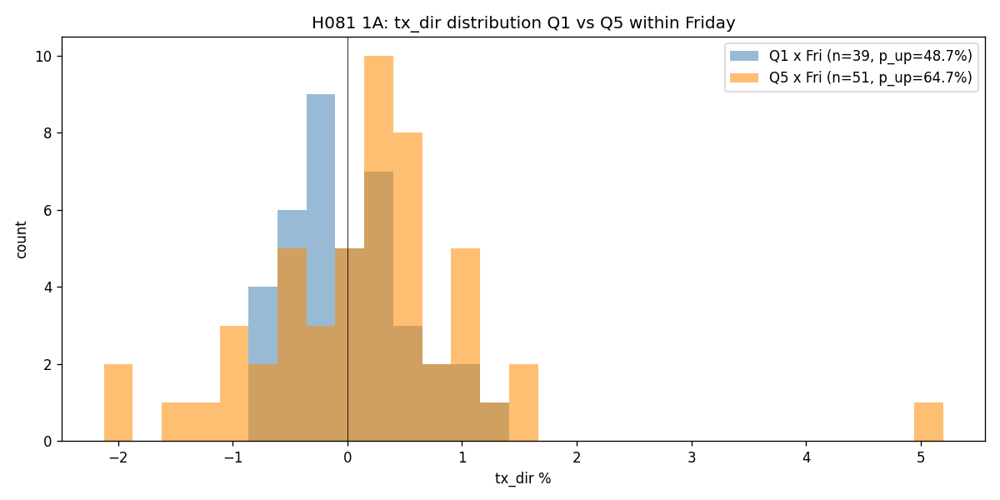

# H081 Phase 1 Distribution Report

**研究**：週五的權值股集中度方向訊號
**執行日期**：2026-05-09
**樣本期間**：2020-12-31 ~ 2026-05-07（1191 個交易日，232 個週五）

---

## 🚨 方法論限定

1. 同期相關性 ≠ 預測力。本研究結論不可直接用於實戰。
2. 沿用 H080 的「核心假設 A」：實戰可用性建立在「早盤集中度 ≈ 全日集中度」之上，需 Phase 1.5 累積即時資料另行驗證。
3. **本研究面臨小樣本問題**：每桶（Q1/Q5 × Fri）只 ~40-50 天，統計力受限。

---

## 1A 樣本與分佈

- 全樣本 1191 天，週五 232 天 (19.5%)
- 週五 × quintile 分佈：Q1=39, Q2=51, Q3=40, Q4=51, Q5=51

### 週五各桶 tx_dir 統計 (%)
| q | n | mean | median | std | p_up |
|---|---|---|---|---|---|
| Q1 | 39 | +0.020 | -0.028 | 0.511 | 48.7% |
| Q2 | 51 | +0.114 | +0.193 | 0.634 | 56.9% |
| Q3 | 40 | +0.000 | +0.085 | 0.731 | 62.5% |
| Q4 | 51 | -0.039 | +0.011 | 0.856 | 51.0% |
| **Q5** | **51** | **+0.182** | **+0.216** | **1.083** | **64.7%** |

Q5 - Q1 = +15.99 pp，median 差 +0.244 pp。但 Q5 std 是 Q1 的 2.1 倍 — Q5 變動更大，統計上更難辨識。



---

## 1B Mann-Whitney U Test

| 比較 | n | p (greater) | 通過 0.05 |
|---|---|---|---|
| Q5×Fri vs Q1×Fri | 51 vs 39 | **0.1006** | ❌ |
| Q5×Fri vs 整體 Fri baseline | 51 vs 232 | **0.1502** | ❌ |
| Q5×Fri vs 整體 baseline | 51 vs 1191 | **0.0907** | ❌ |

**三條全部邊緣不顯著**（p ≈ 0.09-0.15）。MW 對 median 而非 mean 敏感 — Q5 的 median +0.216% vs Q1 -0.028% 的差異，在樣本 ~45 天時不足以通過 0.05 門檻。

---

## 1C Permutation Test（核心 GATE，避免 weekday cherry-picking）

實際 Q5-Q1 (pp) by weekday：
- Mon: -1.99
- Tue: -2.83
- Wed: -3.81
- Thu: +6.06
- **Fri: +15.99** ← 觀察到的 effect

跑 2000 次 shuffle weekday label：

### Test A：純 Friday percentile
實際 Friday Q5-Q1 = +15.99 pp 在 null Friday 分佈中 percentile = **92.3%**。

null Friday Q5-Q1：mean +2.31, std 9.58, 95th pct 17.84

接近但未達 95%。

### Test B：cherry-picking corrected (核心)
實際 |max Q5-Q1 across all weekday| = 15.99 pp 在 null |max| 分佈中 percentile = **61.7%**。

null |max| Q5-Q1：mean **15.10**, std 5.24, 95th pct 24.77

→ 隨機 shuffle 後，**5 個 weekday 中總會有一個 |Q5-Q1| 接近 15 pp**。實際 15.99 跟 random max 差不多。

→ **GATE-2 嚴重失敗**。+15.99 pp 很可能是「在 5 個 weekday 中找最強」的 multiple-comparison artifact。

---

## 1D 早盤訊號相關性

| 樣本 | corr(8:45-9:00, 全日) | corr(8:45-9:15, 全日) |
|---|---|---|
| 全樣本 | +0.278 | +0.473 |

### Q5×Fri 子樣本
- 早盤 15 分 mean dir = +0.037%, 全日 mean = +0.182%（早盤只能看到 1/5 的訊號）
- 早盤 P(上漲) = 51%, 全日 P(上漲) = 65%（**早盤幾乎隨機**）
- 早盤訊號→全日延續率：15 分 58.8%, 30 分 60.8%
- → 即便方向訊號真的存在，**訊號主要在後半盤建立**，不適合 9:00 入場

---

## 1E 前後半樣本穩定性 ✅

| split | 期間 | Fri n | Q5 n | Q1 n | Q5 p_up | Q1 p_up | Q5-Q1 (pp) |
|---|---|---|---|---|---|---|---|
| H1 前半 | 2020-12-31 ~ 2023-11-10 | 118 | 28 | 14 | 71.4% | 57.1% | **+14.29** |
| H2 後半 | 2023-11-13 ~ 2026-05-07 | 114 | 23 | 25 | 56.5% | 44.0% | **+12.52** |

前後半差距 = 1.76 pp（<< 10 pp 門檻）。**現象本身穩定** — 兩段都有 +12 ~ +14 pp 方向性。

---

## 補充：不同 N 的 Q5×Fri p_up

| N | Q5 n | Q1 n | Q5 p_up | Q1 p_up | Q5-Q1 (pp) |
|---|---|---|---|---|---|
| 1 | 56 | 47 | 48.21 | 53.19 | **-4.98** |
| **5** | 52 | 44 | 63.46 | 45.45 | **+18.01** |
| 10 | 50 | 47 | 58.00 | 57.45 | **+0.55** |
| **20** | 51 | 39 | 64.71 | 48.72 | **+15.99** |

訊號**不單調 in N**：N=1 反向、N=10 接近 0、N=5/20 強。如果是真的微結構訊號，期望會 monotonic 或至少同向。**獨立性不一致暗示 noise**。

---

## GATE 結論

| GATE | 條件 | 結果 | 通過 |
|---|---|---|---|
| 1 MW p<0.05（三條） | 三條全部 | p=0.09 / 0.15 / 0.09 | ❌ |
| 2 Permutation（cherry-picking corrected） | percentile ≥ 95% | **61.7%** | ❌ |
| 3 樣本穩定性 | 前後半 Q5-Q1 差距 < 10 pp | 1.76 pp | ✅ |

**三條中兩條失敗**，整體不通過 GATE。

---

## 整體決定：歸檔 Inconclusive

### 為何不是 confirmed
- MW 三條都不顯著（p 0.09-0.15）
- Permutation cherry-picking corrected 揭露 +15.99 pp 接近 random max
- N 不單調（N=10 反常 +0.55）暗示獨立 noise

### 為何不是 rejected
- 前後半都呈現 +12-14 pp 方向性（GATE-3 通過）
- 整體 +15.99 pp 不是「無效應」，是「無法在小樣本中通過嚴格檢驗」
- median 差 +0.24 pp 是有方向性的訊號（雖然 MW 邊緣）
- 主要 fail mode 是**樣本不夠大**，不是「方向訊號根本不存在」

### Inconclusive 的具體含義
1. 證據強度位於 confirm/reject 之間
2. 未來條件可重啟：
   - 累積 +2 年資料（~340 個週五，每 quintile ~70 天）
   - 改換訊號定義（如 N=5 看起來也獨立有 +18，但 N=10 反常 → 需要思考為何）
   - 加入結算週濾網（可能其中一段是真，另一段是 noise）

---

## 衍生假設候選（不立即建檔，記錄於此）

### H08X-A：Friday 訊號 + 結算週分組
- 觀察到的 Friday +16 pp 可能源自「結算前對沖」或「結算後重建」
- 若拆分結算週 vs 非結算週週五，可能找到更純的訊號子集
- 需要先建立「結算週」labeling

### H08X-B：擴展樣本後重做 H081
- 等待 2026-05 ~ 2027-05 累積後，~280 個週五，每桶 ~56 天
- 重跑 1B + 1C，看 cherry-picking corrected percentile 是否提高到 95%
- **這是「等待」型的 hypothesis**，不主動研究

---

## 主要產出

```
research/active/H081-friday-concentration-direction/
├── proposal.md
├── tasks.md
├── distribution.md  (本檔)
├── explore.py
└── results/
    └── 1A_friday_distribution.png
```
