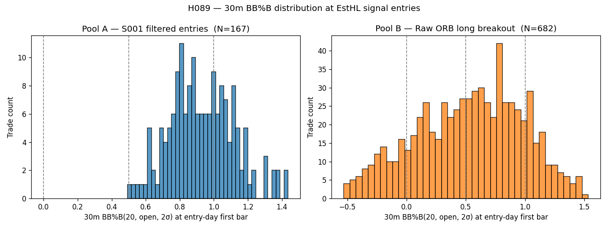
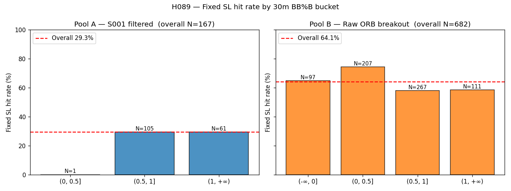
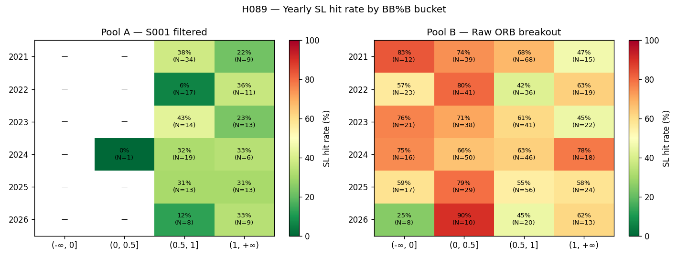

# Distribution Research Results: H089 EstHL BB Over-extension Filter

## Date
2026-05-12

## Conditions Tested

### Data
- **時間範圍**：2021-01-04 → 2026-05-11（5.4 年，1,293 個交易日）
- **資料來源**：`ohlcv_1m` table（TX 日盤 08:45–13:45）

### BB%B definition
與 `runner.load_data_for_exhaustion` 完全一致：
- 30m K bars，`offset="15min"` → 對齊 08:45 / 09:15 / 09:45 / …
- BB(20, 2σ) 套在 30m bar 的 **open** 序列上（跨日連續、不分日）
- 取「日盤第一根 30m bar (08:45–09:15)」的 BB%B 作為當日訊號值
- 公式：`bb_pctb = (open − lower) / (upper − lower)`

### Pool A — Filtered S001 entries
- Strategy：`ORBWithEstHLExitStrategy`（spec.md live 參數）
- Filters：
  - close > OR High（08:45–08:57 區間）
  - VWAP 2-day max + 0.5·sl_dist 之上
  - 0.5 × RollingOR ≤ ORWidth ≤ 1.5 × RollingOR
  - close30 > MA30_20（30m 20MA 向上）
  - Skip Thursday, Skip Friday
- 入場價：1m close（08:58–09:15）

### Pool B — Raw ORB long breakout
- 條件：08:58–09:15 任一根 1m close > OR High（取第一根）
- 無任何其他濾網

### False breakout 定義
- `sl_dist = EmaHL × 0.25`
- **Pool A**：`PnL ≤ −0.95 × sl_dist`（backtesting framework 的 fixed SL 出場）
- **Pool B**：entry 到 13:30 之間任一 1m Low ≤ entry − sl_dist（觸碰即算 SL）

---

## Sample

| Pool | N (有效 BB%B) | 時間 | 平均 EmaHL @ entry |
|---|---|---|---|
| A — S001 filtered | **167** | 2021–2026 | ~140 點 |
| B — Raw ORB long  | **682** | 2021–2026 | ~140 點 |

> Pool B 訊號數約 Pool A 的 4 倍，反映 S001 濾網過濾掉 ~76% 的 raw ORB breakout。

---

## Key Findings

### 1. BB%B 分桶 SL hit rate

#### Pool A (S001 filtered, N=167, overall SL = 29.3%)

| Bucket | N | SL hits | SL rate | Δ vs overall | Mean PnL |
|---|---:|---:|---:|---:|---:|
| (-∞, 0]    |  0 |  — |  —     | —       | — |
| (0, 0.5]   |  1 |  0 |  0.0%  | -29.3pp | +125.0 |
| (0.5, 1]   | 105 | 31 | 29.5%  | **+0.2pp** | +25.3 |
| **(1, +∞)** | **61** | **18** | **29.5%** | **+0.2pp** | +35.9 |

#### Pool B (Raw ORB, N=682, overall SL = 64.1%)

| Bucket | N | SL hits | SL rate | Δ vs overall | Mean PnL |
|---|---:|---:|---:|---:|---:|
| (-∞, 0]    |  97 |  63 | 64.9% | +0.8pp     | +12.2 |
| (0, 0.5]   | 207 | 154 | **74.4%** | **+10.3pp** | −12.1 |
| (0.5, 1]   | 267 | 155 | 58.1% | −6.0pp     | +17.4 |
| **(1, +∞)** | **111** | **65** | **58.6%** | **−5.5pp** | +5.6 |

### 2. 跨年度方向一致性（BB>1 桶 vs 該年整體 SL hit rate）

#### Pool A

| Year | All SL% | BB>1 N | BB>1 SL% | Δ (pp) | 方向 |
|---|---:|---:|---:|---:|:---:|
| 2021 | 34.9% |  9 | 22.2% | −12.7 | ← against |
| 2022 | 17.9% | 11 | 36.4% | +18.5 | → favorable |
| 2023 | 33.3% | 13 | 23.1% | −10.2 | ← against |
| 2024 | 30.8% |  6 | 33.3% |  +2.5 | → favorable (marginal) |
| 2025 | 30.8% | 13 | 30.8% |   0.0 | = neutral |
| 2026 | 23.5% |  9 | 33.3% |  +9.8 | → favorable (marginal) |

**Pool A 一致性**：favorable 3 / against 2 / neutral 1（含邊際）— 不足以聲稱穩定效果

#### Pool B

| Year | All SL% | BB>1 N | BB>1 SL% | Δ (pp) | 方向 |
|---|---:|---:|---:|---:|:---:|
| 2021 | 68.7% | 15 | 46.7% | −22.0 | ← against |
| 2022 | 61.3% | 19 | 63.2% |  +1.9 | → favorable (marginal) |
| 2023 | 63.9% | 22 | 45.5% | −18.4 | ← against |
| 2024 | 67.7% | 18 | 77.8% | +10.1 | → favorable |
| 2025 | 61.9% | 24 | 58.3% |  −3.6 | ← against (marginal) |
| 2026 | 54.9% | 13 | 61.5% |  +6.6 | → favorable (marginal) |

**Pool B 一致性**：favorable 3 / against 3 — 完全平手，且兩個最強年份方向相反

### 3. 意外觀察

#### Pool A 幾乎沒有 BB%B ≤ 0.5 的 entries
- (-∞, 0] 桶 N=0；(0, 0.5] 桶 N=1
- S001 的 VWAP + 30m MA20 上行 + OR-width 濾網，**已經把 entries 集中在 BB%B > 0.5 的區段**
- 也就是說 S001 已經自然避開「弱多頭」與「下行」的進場時點
- 在剩下的 BB%B > 0.5 中再切 0.5–1 vs >1，**效果消失（兩桶 SL rate 完全相同 29.5%）**

#### Pool B 真正的假突破熱區是 (0, 0.5]，不是 (1, +∞)
- (0, 0.5] 桶 SL rate **74.4%**，PnL mean −12.1 點 — 全 pool 最糟
- (1, +∞) 桶 SL rate 58.6%，PnL mean +5.6 點 — 比整體 64.1% 更好
- 直覺上「弱多頭區段（剛站上 BB middle）的 ORB 突破」反而是高假突破熱區
- 而「強多頭區段（已在 BB upper 外）的 ORB 突破」反而較能延續

---

## Vs. Expected

| 預期 | 實測 | 結果 |
|---|---|---|
| Pool A BB>1 桶 N ≥ 20 | N=61 | ✅ 樣本充足 |
| Pool A BB>1 SL rate 比整體高 ≥ 10pp | +0.2pp | ❌ 效果為零 |
| Pool A 5 年中 ≥ 3 年方向一致 | 3/6 favorable（含邊際） | ⚠ 邊緣不足 |
| Pool B 確認方向一致 | Pool B 為 **−5.5pp**（反向） | ❌ Pool B 方向相反 |
| BB>1 佔比 15–30% | A: 37%、B: 16% | ⚠ A 偏高、B 偏低 |

**核心假設未獲支持**：

1. Pool A 在 S001 濾網下，BB%B > 1 與 ≤ 1 的 SL hit rate **完全相同**（29.5% vs 29.5%）
2. Pool B 在無濾網下，BB%B > 1 反而比整體 **低** 5.5pp，方向與假設相反
3. 兩 pool 跨年度一致性都不足 3/5

### 為何假設失敗？事後解讀（非結論）

- S003 Exhaustion 用 BB>1 做空 reversal 是 confirmed 的 — 但 Exhaustion 額外要求 `ma_up + NightNewHigh + ORB 跌破`。**BB>1 單一條件不足以代表「力竭」**，還要配合夜盤新高與日內反向破壞才成立
- ORB 突破做多的本質是「動能延續」。BB>1 反而可能是「強勢市況」訊號，與 ORB 突破的訊號性質互補（而非互斥）
- (0, 0.5] 桶在 Pool B 表現最差 — 暗示「BB%B 接近 middle 的 ORB 突破」才是真正的高機率假突破，因為缺乏方向確認

---

## Gate Decision

**Phase 1 GATE: 4 條件中 3 條未通過**

| GATE 條件 | 達成? |
|---|:---:|
| Pool A BB>1 桶 ≥ 20 筆 | ✅ N=61 |
| Pool A SL rate 差距 ≥ 10pp | ❌ +0.2pp |
| 5 年方向一致 ≥ 3 | ⚠ 邊際（3 favorable 含邊際 / 2 against / 1 neutral） |
| Pool B 確認方向一致 | ❌ Pool B 反向（−5.5pp） |

**決定建議：**
- [ ] 繼續 Phase 2
- [x] **直接 Archive（Rejected）**：核心效果為零，Pool B 反向
- [ ] 修改假設後重跑

---

## Derived Hypotheses

衍生想法（記錄供後續評估，不主動立檔）：

1. **H0XX：「弱多頭區段 ORB 突破」假突破熱區研究**
   - Pool B (0, 0.5] 桶 SL rate 74.4%，比整體高 10.3pp，且樣本 N=207 充足
   - 但 Pool A 該桶 N=1（S001 已天然濾掉），所以這個效應對 S001 不 actionable
   - 若反向用：「BB%B 在 (0, 0.5] 時做空 ORB 突破」可能有效，但需另立假設驗證

2. **H0XX：S003 Exhaustion 的 BB>1 條件需配合 NightNewHigh 才有效**
   - 觀察依據：BB>1 單獨不足以預測假突破
   - 可在 Pool B 上加 NightNewHigh 篩選後，重看 SL rate 分桶
   - 若 BB>1 ∧ NightNewHigh 顯著高 SL，則 S003 邏輯 transferable 到 S001 反向

3. **H0XX：BB%B middle-cross 動量檢驗**
   - Pool B 顯示 BB%B = 0.5 附近是分水嶺
   - 是否「30m BB%B 從 < 0.5 上穿 > 0.5 時的 ORB 突破」是真正的高品質訊號？

---

## Links

- Proposal: `../proposal.md`
- Tasks: `../tasks.md`
- Explore script: `../explore.py`
- Raw trades: `pool_a_trades.csv`, `pool_b_trades.csv`
- Bucket stats: `pool_a_bucket_stats.csv`, `pool_b_bucket_stats.csv`
- Yearly stats: `pool_a_year_bucket_stats.csv`, `pool_b_year_bucket_stats.csv`
- Plots: `bbpct_hist.png`, `sl_rate_bars.png`, `yearly_heatmap.png`
